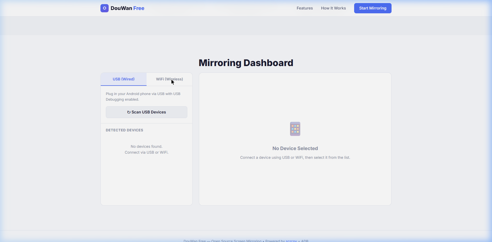

# DouWan Free — Open Source Screen Mirroring Engine

DouWan Free is a powerful, open-source, and localized screen mirroring application for Windows. It provides ultra-low latency mirroring, device control, and a modern UI to seamlessly cast your Android device to your PC.



## 🚀 Latest Features (V2.0)

- **🆕 Virtual Camera Support**: Mirror your Android screen directly into Zoom, Teams, or OBS as a virtual webcam.
- **🆕 OBS Plugin Mode**: Optimized one-click setup for streamers to capture gameplay with zero-border windows and always-on-top positioning.
- **🆕 Multistreaming Support**: Integrated support for multistreaming directly from the scrcpy output.
- **Plug & Play USB Mirroring**: Connect via USB and mirror instantly.
- **Wireless Mirroring**: Auto-discover and connect via ADB TCP/IP.
- **Android 11+ Wireless Pairing**: Pair devices over WiFi via pairing code.
- **High Performance**: Powered by `scrcpy` 3.0+ for 2K/4K resolution and up to 120 FPS.
- **PC Control**: Full mouse and keyboard control.
- **Audio Forwarding**: Native Android audio streaming to PC.
- **100% Free**: No login, no paywalls, no tracking.

## 🛠️ Prerequisites

Ensure you have the following installed and in your PATH:

1. **ADB (Android Debug Bridge)**  
   `winget install Google.PlatformTools`
2. **scrcpy** (v2.0+)  
   `winget install Genymobile.scrcpy`
3. **FFmpeg** (For streaming/recording)  
   `winget install Gyan.FFmpeg`

*Enable **USB Debugging** on your Android device in Developer Options.*

## 📦 Building from Source

### Requirements
- Python 3.10+
- Dependencies: `Flask`, `pywebview`, `mss`, `pyvirtualcam`, `opencv-python`, `numpy`, `pygetwindow`

### Installation
```bash
git clone https://github.com/venomrk/duwan-opensource-free-screen-share-pc.git
cd duwan-opensource-free-screen-share-pc

# Install Python dependencies
pip install -r requirements.txt

# Run the application
python main.py
```

### 🔨 Compiling to Executable
```bash
pip install pyinstaller
pyinstaller DouWan_Free.spec
```

## 🤝 Contributing

This project is built on the shoulders of giants. Special thanks to [Genymobile/scrcpy](https://github.com/Genymobile/scrcpy).

## 📄 License

Open-source under MIT License. No restrictions.
